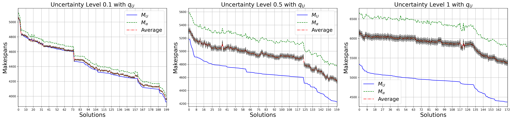
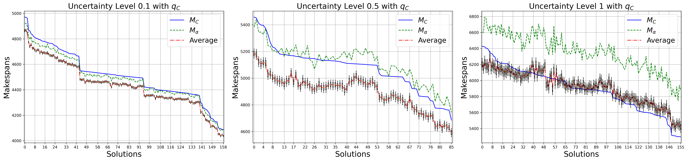

# Proactive Data-driven Scheduling of Business Processes


### Step 1: Install the Package

To install the package and its dependencies, including the MONA tool, use the following commands:

```bash
pip install -r requirements.txt
pip install -e .
```

### Rims Simulator

The folder "src_simulator" contains the modified RIMS simulator (https://francescameneghello.github.io/RIMS_tool/index.html), which takes a JSON file as input, as shown in the "main.py" file.
The configurations for all experiments are stored in the "syn_data" folder, categorized by uncertainty levels and with/without resource calendars.

### CP solver

The folder "cp_solver" contains the solver and the JSP benchmarks used as starting problems, which were then modified to suit our needs.
Run the "ortool_solver.py" file.




Comparison of all $M_C$ solutions returned by the CP solver with $q_C$, along with their corresponding $M_{\alpha}$ values and the \emph{Average} computed over 1,000 simulations, for the synthetic \act{medium} problem without calendars for each level of uncertainty ($0.1, 0.5, 1.0$).


Comparison of all $M_U$ solutions returned by the CP solver with $q_U$, along with their corresponding $M_{\alpha}$ values and the \emph{Average} computed over 1,000 simulations, for the synthetic \act{medium} problem without calendars for each level of uncertainty ($0.1, 0.5, 1.0$).
