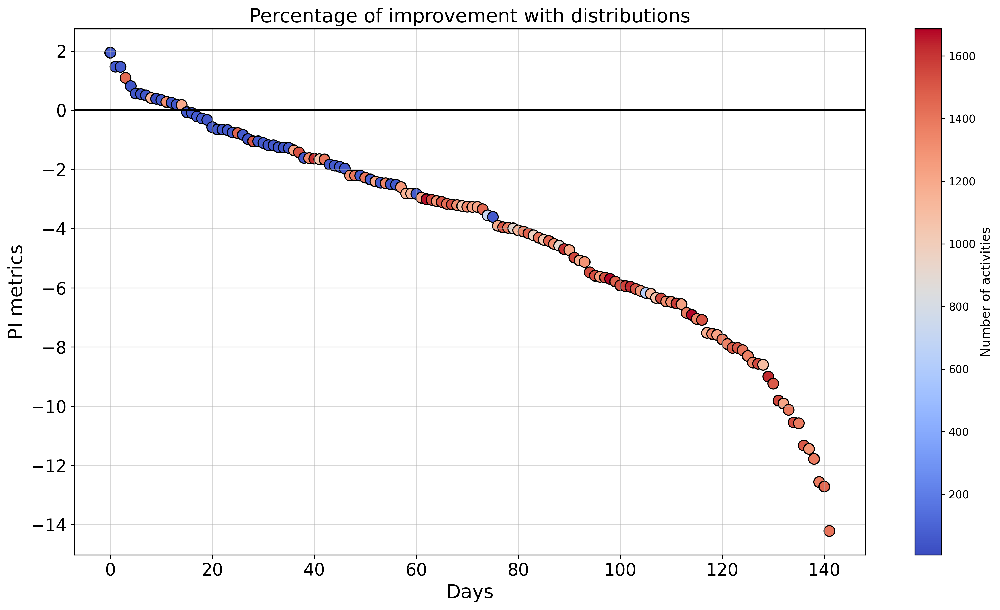

# Proactive Data-driven Scheduling of Business Processes


### Step 1: Install the Package

To install the package and its dependencies, including the MONA tool, use the following commands:

```bash
pip install -r requirements.txt
pip install -e .
```

### Rims Simulator

The folder "src_simulator" contains the modified RIMS simulator (https://francescameneghello.github.io/RIMS_tool/index.html), which takes a JSON file as input, as shown in the "main.py" file.
The configurations for all experiments are stored in the "syn_data" folder, categorized by uncertainty levels and with/without resource calendars.

## Supplementary Material -- Proactive Data-driven Scheduling of Business Processes

### Results with JSP benchmarks with different size and levels of uncertainty (Extended version of table 2 of paper)

Table provides an extended overview of the first set of experiments (Table 2 of the paper). 
It reports, for each problem, the minimum Makespan obtained with the CP solver ($M^*_{C}$), the probabilistic minimum Makespan ($M^*_{\alpha}$), along with the corresponding mean ($\mu^*_{\alpha}$) and standard deviation ($\sigma^*_{\alpha}$).  
Moreover, presents the results for three additional problems of varying sizes: \{($20 \times 15$), ($30 \times 15$), and ($40 \times 20$)\}. 
All the benchmarks are retrieved from the work[Reijnen et al., 2023], which provides well-known job scheduling problems, along with a parser and utility functions to handle them.

| Name        | Size     | Unc. Level | $q_C$ | Sets $M^*_C$ | $M^*_{α}$ | $\mu^*_{α}$ | $\sigma^*_{α}$ | NP   | Calendars $M^*_C$ | $M^*_{α}$ | $\mu^*_{α}$ | $\sigma^*_{α}$ | NP   |
|-------------|----------|------------|-------|--------------|-----------|-------------|----------------|------|-------------------|-----------|-------------|----------------|------|
| **abz5**    | 10 x 10  | 0.1        | 0.623 | 1264         | 1267.117  | 1247.123    | 12.605         | 1.00 | 6306              | 6318.929  | 6311.387    | 34.791         | 1.00 |
|             |          | 0.5        | 0.612 | 1412         | 1461.083  | 1375.390    | 55.351         | 1.03 | 6522              | 6557.094  | 6530.092    | 309.877        | 1.00 |
|             |          | 1.0        | 0.582 | 1606         | 1818.667  | 1634.942    | 118.814        | 1.13 | 10592             | 12012.313 | 10405.540   | 1254.506       | 1.13 |
| **abz7**    | 20 x 15  | 0.1        | 0.617 | 857          | 984.894   | 920.013     | 41.663         | 1.15 | 10532             | 10544.230 | 10550.919   | 181.384        | 1.00 |
|             |          | 0.5        | 0.631 | 876          | 985.649   | 917.516     | 40.973         | 1.12 | 10845             | 10880.421 | 10884.615   | 261.896        | 1.00 |
|             |          | 1.0        | 0.592 | 870          | 985.131   | 911.594     | 42.759         | 1.13 | 10584             | 11672.917 | 10672.633   | 340.185        | 1.10 |
| **cscmax 20\_20\_2** | 20 x 20  | 0.1        | 0.726 | 4088         | 4079.711  | 4041.146    | 24.760         | 0.99 | 17305             | 17310.267 | 17305.266   | 136.515        | 1.00 |
|             |          | 0.5        | 0.697 | 4686         | 4810.094  | 4600.222    | 121.340        | 1.03 | 21413             | 23461.411 | 22547.239   | 790.885        | 1.10 |
|             |          | 1.0        | 0.657 | 5297         | 5836.450  | 5442.214    | 235.606        | 1.10 | 22802             | 27096.049 | 24824.725   | 1415.784       | 1.10 |
| **cscmax 30\_15\_2** | 30 x 15  | 0.1        | 0.680 | 5014         | 4987.340  | 4931.863    | 32.466         | 0.99 | 21701             | 21717.042 | 21711.987   | 4.136          | 1.00 |
|             |          | 0.5        | 0.657 | 5708         | 5792.257  | 5567.154    | 143.244        | 1.01 | 23417             | 24833.082 | 23561.022   | 464.668        | 1.06 |
|             |          | 1.0        | 0.724 | 6324         | 6854.744  | 6459.147    | 246.865        | 1.08 | 34605             | 34605.057 | 32865.581   | 837.235        | 1.00 |
| **cscmax 40\_20\_5** | 40 x 20  | 0.1        | 0.653 | 6716         | 6689.988  | 6628.501    | 36.241         | 0.99 | 33950             | 35390.976 | 34151.698   | 516.134        | 1.04 |
|             |          | 0.5        | 0.690 | 8569         | 8524.441  | 8258.515    | 159.984        | 0.99 | 32384             | 35267.634 | 33782.977   | 1389.356       | 1.09 |
|             |          | 1.0        | 0.648 | 8966         | 9622.562  | 9167.436    | 289.895        | 1.07 | 35523             | 43038.499 | 40990.318   | 2387.814       | 1.21 |
| **cscmax 50\_20\_3** | 50 x 20  | 0.1        | 0.660 | 9152         | 10003.942 | 9914.975    | 51.546         | 1.09 | 35227             | 35371.868 | 35386.501   | 385.263        | 1.00 |
|             |          | 0.5        | 0.669 | 10098        | 10883.093 | 10508.788   | 246.608        | 1.07 | 37071             | 42722.843 | 39524.659   | 2329.438       | 1.07 |
|             |          | 1.0        | 0.668 | 10921        | 12271.145 | 11812.203   | 356.501        | 1.12 | 44085             | 51451.363 | 46689.336   | 2154.574       | 1.18 |


Figure below shows the deterministic solutions obtained using the CP solver with $q_C$, namely $M_C$, and the corresponding performance over $1000$ simulations, expressed by $M_\alpha$ and the average Makespan. In contrast, Figure~\ref{fig:q1_results} presents the same results but computed with $q_U$ on the same benchmark (\act{medium}($20 \times 20$) without resource calendars). From Figures~\ref{fig:q3_results} and \ref{fig:q1_results}, it is evident that $q_U$ ensures a lower bound, which is not always guaranteed with $q_C$. However, the latter is capable of producing a probabilistic Makespan that is closer to the deterministic one and achieves a smaller probabilistic Makespan with fewer solutions, given the same time limit for the CP solver to retrieve the solutions.


### Percentage of Improvement

We extend the results reported in the paper by adding the following Figure, showing the trend of $PI$ metrics respect to the number of activities treated in BPSP problem defined over DayHospital data. 


